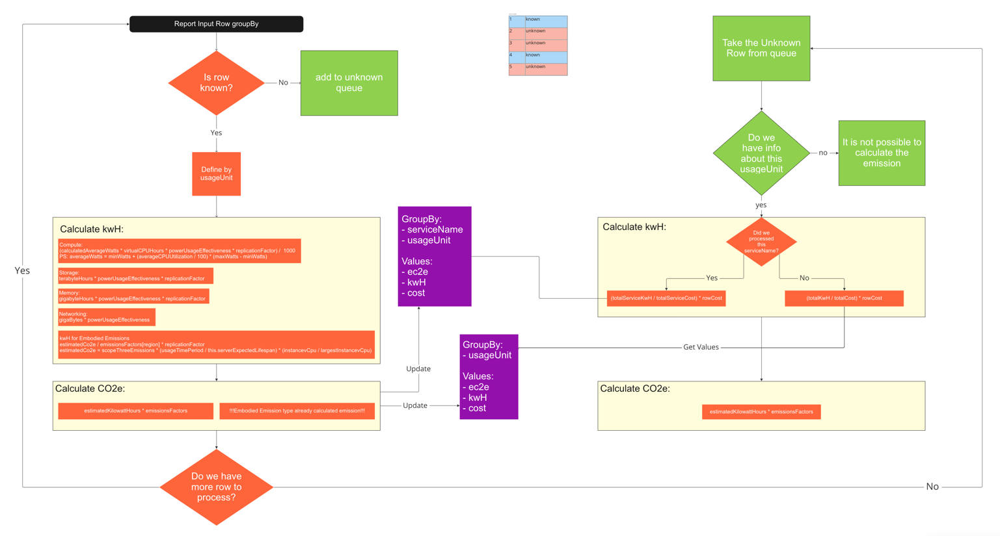

## Here is the general documentation related to `@cloud-carbon-footprint/report-processing` in particularly.

# changes applied for between original app is:

- Added `@cloud-carbon-footprint/report-processing`
- In the package `@cloud-carbon-footprint/common` was updated a logger.ts file, AWS logger was added to integrate CloudWatch
- Package `@cloud-carbon-footprint/app` was updated with 

### Setup and Run the app on Development LSEG environment

- Setup LSEG proxy [find more info here](https://lsegroup.sharepoint.com/:w:/r/teams/CarbonEmissionsTracking/Shared%20Documents/General/How+to+setup+development+environment.doc?d=w2aecb19a49a249199655b593adee86bc&csf=1&web=1&e=bG0KjO)
- Install terraform [find more info here](https://lsegroup.sharepoint.com/:w:/r/teams/CarbonEmissionsTracking/Shared%20Documents/General/How+to+setup+development+environment.doc?d=w2aecb19a49a249199655b593adee86bc&csf=1&web=1&e=bG0KjO)
- Install Node.js 16.x, you could find it on official site, or [here](https://nodejs.org/dist/latest-v16.x/)
- Install yarn ```npm i -G yarn```
- Add yarn configuration to use LSEG nexus. You can do it in CLI or update the `.yarnrc.yml` file manually by adding `npmRegistryServer: "https://nexus.lseg.stockex.local/repository/npm-registry/"` and `enableStrictSsl: false`
- install dependencies with `yarn`
- run `yarn lerna run build` from root app folder
- Install aws-lseg-saml-auth package for update AWS keys [find more info here](https://lsegroup.sharepoint.com/:w:/r/teams/CarbonEmissionsTracking/Shared%20Documents/General/How+to+setup+development+environment.doc?d=w2aecb19a49a249199655b593adee86bc&csf=1&web=1&e=bG0KjO)
- create a .env file in `packages/report-processing` directory, use a .env-template as a starting point
- run `yarn start` to lunch the app
- to perform tests, use `yarn test` command


### Deploy infrastructure

* Lunch terraform script, see instruction in the [infrastructure repo](https://gitlab.dx1.lseg.com/app/app-50896/emistrac-infrastructure/-/tree/autoscaling-lseg/terraform)

### Deploy new version of the cloud-carbon-footprint app

* Install dependencies locally like described [here](#setup-and-run-the-app-on-development-lseg-environment) and zip the whole cloud-carbon-footprint project folder
* Upload it to s3 bucket to `emistrac-poc-carbon-emission-reports-euwest2-s3/artifacts` with the name `cloud-carbon-footprint.zip`
* Create an instance which should base on AWS linux golden AMI [see the list of avalible images here](https://lsegdocs.lseg.stockex.local/display/CLOUD/AWS+AMI+Release+Info)
* Through ssh connection apply the script line by line from terraform repo, which calls `start-no-asg.sh`
* You could check the status of the app through logs, the default log group is `apps` and the default stream is `ccf`. There is also possibility to check the local logs through ssh connection (add command)
* Go to ec2 instances list and create an image
* Copy AMI ID of created image
* Update AMI ID the `variables.tf` in `emistrac-infrastructure` repo with new AMI ID
* Apply the updated configuration by running terraform script

### How to get logs

The CloudWatch logs are available [here](https://eu-west-2.console.aws.amazon.com/cloudwatch/home?region=eu-west-2#logsV2:log-groups/log-group/apps/log-events/ccf)

Also, it is possible to get logs from AMI directly, then you need:
- Connect to it through SSH client
- run command `journalctl -u cloud-carbon-footprint`

### How to use the ccf app

Main idea is to create a copy of report with added columns which contains an energy consumption and carbon footprint emission.

To use the app you should upload report data to [source bucket](https://s3.console.aws.amazon.com/s3/buckets/emistrac-poc-cur-reports-euwest2-s3?region=eu-west-2&tab=objects).
After processing, it should be available in [destination bucket](https://s3.console.aws.amazon.com/s3/buckets/emistrac-poc-carbon-emission-reports-euwest2-s3?region=eu-west-2&tab=objects).
Those options could be changed by configure the .env file which created during deployment

### Update the CCF app
You can simply merge all changes from original repo [here](https://github.com/cloud-carbon-footprint/cloud-carbon-footprint)

## Description
this application was created for processing the CUR report line by line with scalability in mind.
There are several issues with lookup table such as:
- issue in calculation of the unknown rows
- not scalable, means the athena query could not approach by parts, it should be loaded entirely in the RAM
- required external athena + glue configuration

This application is a part of this project:


#### Here is a visualization how the cloud-carbon-footprint app works:



As you can see, we are not able to calculate unknown rows before we calculate all known rows.


#### Here you'll find the original repo README file below

# Cloud Carbon Footprint

[](https://opensource.org/licenses/Apache-2.0)

[](https://codecov.io/gh/cloud-carbon-footprint/cloud-carbon-footprint)

[Cloud Carbon Footprint](https://www.cloudcarbonfootprint.org) is an application that estimates the energy (kilowatt-hours) and carbon emissions (metric tons CO2e) of public cloud provider utilization.

If you would like to learn more about the various calculations and constants that we use for the emissions estimates, check out the [Methodology page](https://www.cloudcarbonfootprint.org/docs/methodology).

## Getting Started

The core logic is exposed through 2 applications: a CLI and a website. The CLI resides in `packages/cli/`, and the website is split between `packages/api/` and `packages/client/`

For instructions on how to get up and running, please visit the [Getting Started page](https://www.cloudcarbonfootprint.org/docs/getting-started).

## Project

Please visit the [project board](https://github.com/orgs/cloud-carbon-footprint/projects/4/views/1) to get a glimpse of the roadmap or to submit an [issue or bug](https://github.com/cloud-carbon-footprint/cloud-carbon-footprint/issues).

## Join Us!

To begin as a contributor, please see the [contributing page](CONTRIBUTING.md).
Please read through our [code of conduct](CODE_OF_CONDUCT.md) for our expectations around this community.

⭐️Give us a star if you like the project or find this work interesting!

### Don’t be shy

If you're using or planning to use CCF in any capacity, please add to our list of **[adopters](https://github.com/cloud-carbon-footprint/cloud-carbon-footprint/blob/trunk/ADOPTERS.md)**. Having an understanding of the use of CCF (what it's being used for, what setup is used, cloud providers used, size of org and data, etc.) will help us better evolve the tool to meet the needs of this community.

Additionally, please fill out our **[feedback form](https://forms.gle/Sp58KuwvGiYNS7ko6)** to provide us more insight about your use of CCF and how we can best support your needs.

Reach out with any questions, support requests, and further discussions in our **[discussion google group](https://groups.google.com/g/cloud-carbon-footprint)**.

## License

Licensed under the Apache License, Version 2.0: <http://www.apache.org/licenses/LICENSE-2.0>

© 2021 Thoughtworks, Inc.
