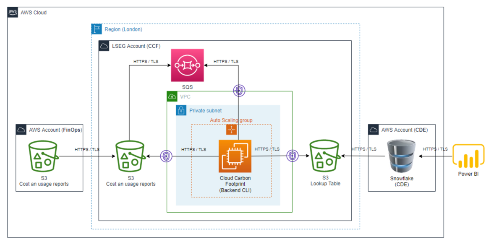
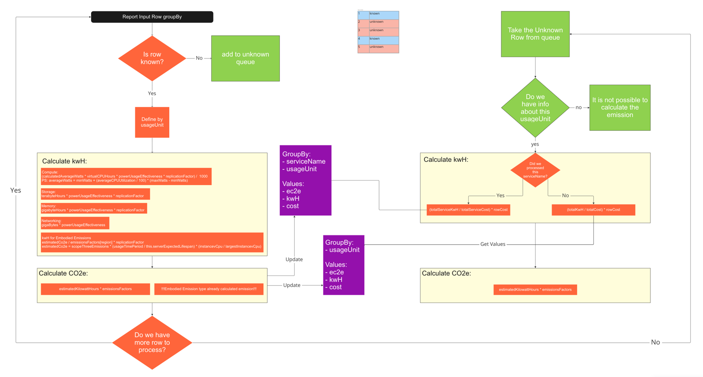

# `@cloud-carbon-footprint/report-processing`

### Setup and Run the app on Development LSEG environment

- Setup LSEG proxy [find more info here](https://lsegroup.sharepoint.com/:w:/r/teams/CarbonEmissionsTracking/Shared%20Documents/General/How+to+setup+development+environment.doc?d=w2aecb19a49a249199655b593adee86bc&csf=1&web=1&e=bG0KjO)
- Install terraform [find more info here](https://lsegroup.sharepoint.com/:w:/r/teams/CarbonEmissionsTracking/Shared%20Documents/General/How+to+setup+development+environment.doc?d=w2aecb19a49a249199655b593adee86bc&csf=1&web=1&e=bG0KjO)
- Install Node.js 16.x, you could find it on official site, or [here](https://nodejs.org/dist/latest-v16.x/)
- Install yarn ```npm i -G yarn```
- Add yarn configuration to use lseg nexus. You can do it in CLI or update the `.yarnrc.yml` file manually by adding `npmRegistryServer: "https://nexus.lseg.stockex.local/repository/npm-registry/"` and `enableStrictSsl: false`
- install dependencies with `yarn`
- Install aws-lseg-saml-auth package for update AWS keys [find more info here](https://lsegroup.sharepoint.com/:w:/r/teams/CarbonEmissionsTracking/Shared%20Documents/General/How+to+setup+development+environment.doc?d=w2aecb19a49a249199655b593adee86bc&csf=1&web=1&e=bG0KjO)
- create a .env file in `packages/report-processing` directory, use a .env-template as a starting point
- run `yarn start` to lunch the app
- to perform tests, use `yarn test` command


### Deploy infrastructure

* Lunch terraform script, see instruction in the [infrastructure repo](https://gitlab.dx1.lseg.com/app/app-50896/emistrac-infrastructure/-/tree/autoscaling-lseg/terraform)

### Deploy new version of the cloud-carbon-footprint app

* Install dependencies locally like described [here](#setup-and-run-the-app-on-development-lseg-environment) and zip the whole cloud-carbon-footprint project folder
* Upload it to s3 bucket to `emistrac-poc-carbon-emission-reports-euwest2-s3/artifacts` with the name `cloud-carbon-footprint.zip`
* Create an instance which should base on AWS linux golden AMI with name like `CIS Amazon Linux 2 Kernel 4.14 Benchmark v2.0.0.17` [see more information here](https://lsegdocs.lseg.stockex.local/pages/viewpage.action?spaceKey=CLOUD&title=AWS+AMI+Release+Info)
* Through ssh connection apply the script line by line from terraform repo, which calls `start-no-asg.sh`
* You could check the status of the app through logs, the default log group is `apps` and the default stream is `ccf`. There is also possibility to check the local logs through ssh connection (add command)  
* Go to ec2 instances list and create an image
* Copy AMI ID of created image
* Update AMI ID the `variables.tf` in `emistrac-infrastructure` repo with new AMI ID
* Apply the updated configuration by running the terraform script

### Update the CCF app
You can simply merge all changes from original repo [here](https://github.com/cloud-carbon-footprint/cloud-carbon-footprint)

## Description
this application was created for processing the CUR report line by line with scalability in mind.
There are several issues with lookup table such as:
- issue in calculation of the unknown rows
- not scalable, means the athena query could not approach by parts, it should be loaded entirely in the RAM
- required external athena + glue configuration

This application is a part of this project:



#### Here is an visualization how the cloud-carbon-footprint app works



As you can see, we are not able to calculate unknown rows before we calculate all known rows.

